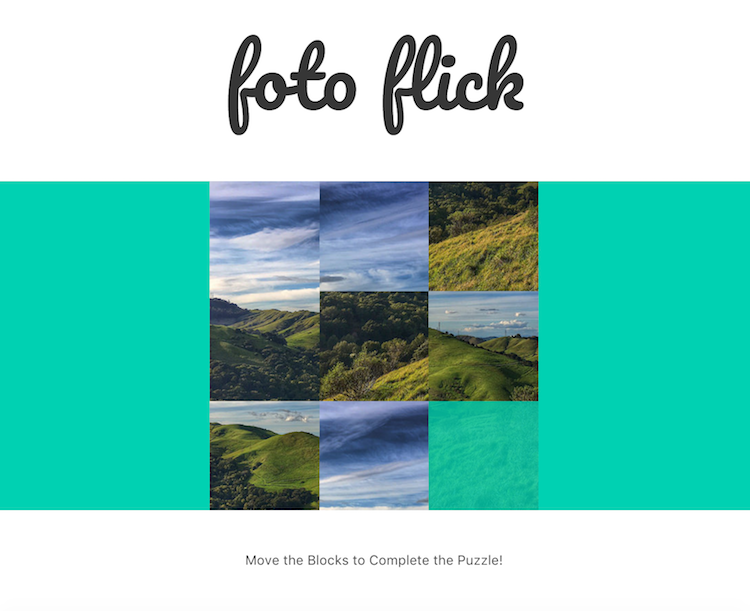

# Foto-Flick

Puzzle slide with Flickr images.

This puzzle game uses the Flickr API to get the most recently uploaded image, resizes and crops the image as appropriate, splits it into a 3x3 tile board, shuffles the tiles up, and allows a player to slide the tiles around and try to reassemble the original image.

  

Written as an introductory exercise to React.

### todos
* Center non-square images
* Add game options such as: shuffle, load new image, solve

This project was bootstrapped with [Create React App](https://github.com/facebookincubator/create-react-app)
and inspired by the [Tic Tac Toe Tutorial](https://facebook.github.io/react/tutorial/tutorial.html).
